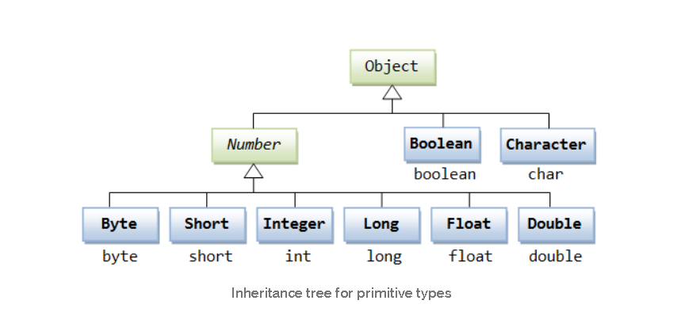

In Java, we deal with basic types (e.g. int, boolean, ...) or with object types (e.g. an object based on a class).

Collections in Java work basically on objects. Fortunately, there are special classes in Java that correspond to base types - they are called wrappers.

For example, the base type int corresponds to the Integer object type. The underlying type of boolean corresponds to the Boolean object type. Without going into how it is implemented in Java yet, it is enough to remember that direct assignments between base types and their corresponding object types are possible. Thus, a variable of object type can be assigned to a variable of base type:

```java
int n = 10;
Integer k = n;
int q = k;
```

In the above example, we can see that the variable __n__, being the base type int, is assigned to the variable __k__ having the Integer object type.

The full list of wrappers available in Java is below:



You are probably wondering why we mentioned wrappers now. This is because collections always hold object types, so to use any base type, e.g. int, in a collection, we need to use its __wrapper__.